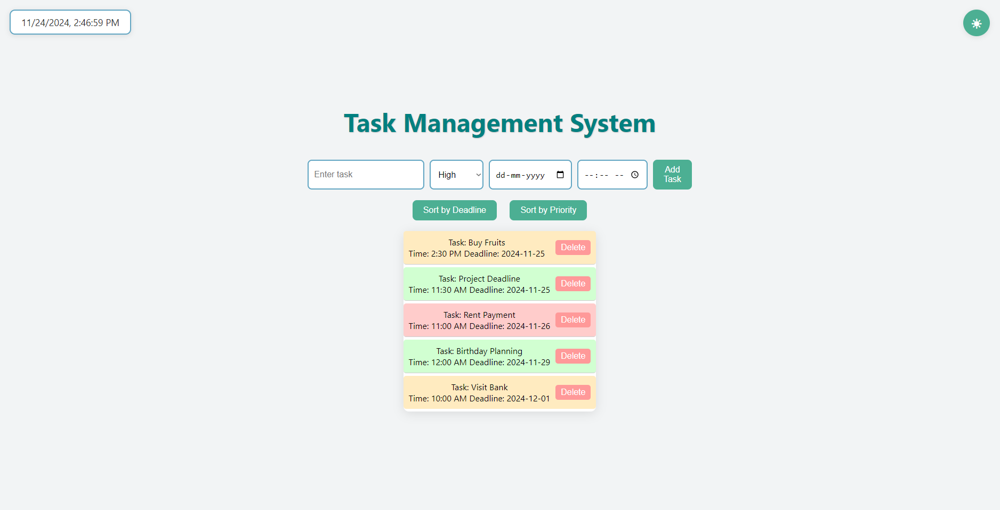
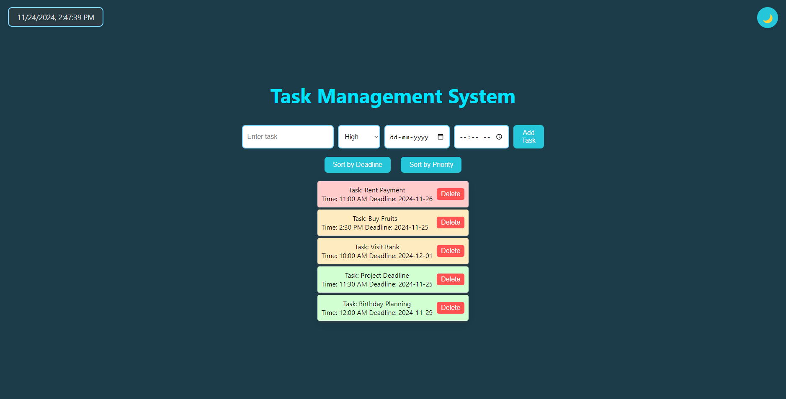

# TaskFlow: Task Management System

## About the Project

TaskFlow is a web-based task management application that helps you organize and prioritize your tasks effectively. It features a user-friendly interface for managing tasks, sorting by priority or deadline, and toggling between light and dark themes.

- **Light Mode**
  
   

- **Dark Mode**
  
   

---
## Features

- **Add Tasks**: Create tasks with a name, priority, deadline, and optional time.
- **Delete Tasks**: Remove completed or unnecessary tasks.
- **Sort Tasks**: Sort tasks by deadline or priority for better organization.
- **Real-Time Updates**: Displays the current date and time dynamically.
- **Dark/Light Theme**: Toggle between dark and light themes for personalized aesthetics.
- **Responsive Design**: Works seamlessly on desktops and mobile devices.
---
## Technologies Used

- **Backend**: Flask (Python)
- **Frontend**: HTML, CSS, JavaScript
- **Data Management**: Priority Queue (Heap)
- **Styling**: Custom CSS with light and dark mode support
---
## Project Structure
```plaintext
TaskFlow/
├── app.py
├── tasks.py
├── templates/
│   └── index.html
├── static/
│   ├── css/
│   │   └── style.css
│   ├── js/
│   │   └── script.js
├── LICENSE
├── CODE_OF_CONDUCT.md
├── README.md
└── requirements.txt
```
---
## **Setup Instructions**
### Prerequisites
Ensure you have Python 3.8+ and `pip` installed on your system.

### Steps to Run Locally
1. Clone the repository:
   ```bash
   git clone https://github.com/Ayushpremrocks/Multi-language-Text-To-Speech

2. Create a Virtual Environment (Optional but Recommended):
   ```bash
   python -m venv venv
   source venv/bin/activate    # On macOS/Linux
   venv\Scripts\activate       # On Windows


3. Install dependencies:
   ```bash
   pip install -r requirements.txt
   
4. Run the Flask app:
   ```bash
   python app.py

5. Open your browser and go to:
   ```bash
   http://127.0.0.1:5000
---
### How to Check Flask Installation and Version
1. **Verify Flask Installation:** Run the following command in your terminal
   ```bash
   python -m flask --version
   ```
   If Flask is installed, you will see output similar to this:
   ```bash
   Flask 2.3.3
   Python 3.x.x

2. **If Flask is Not Installed:** Install Flask using:
   ```bash
   pip install Flask
   ```
---

## License

This project is licensed under the MIT License - see the [LICENSE](LICENSE) file for details.

